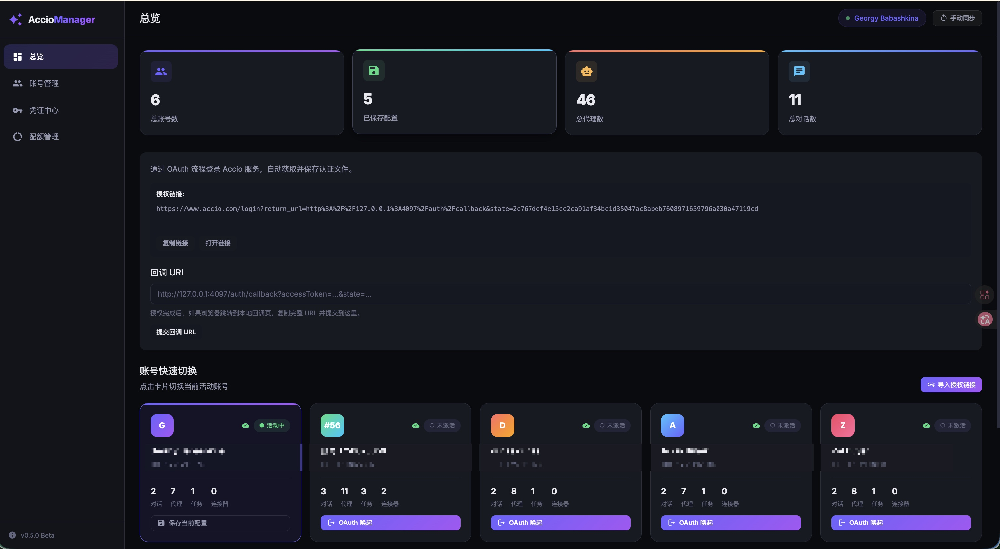
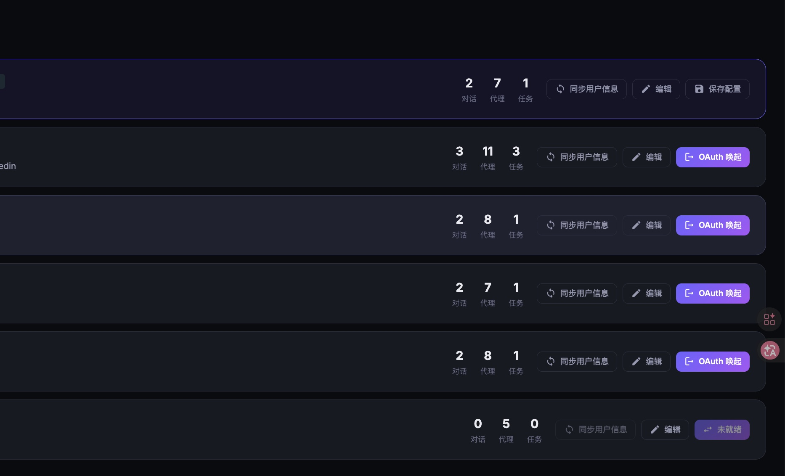
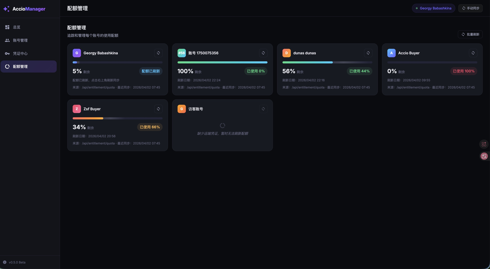

# Accio Manager 使用文档

本文档面向首次使用和公开仓库访客，按实际使用顺序介绍安装、启动、授权和常见页面操作。

文档中的截图均应为脱敏版本，不包含真实 Token、Cookie、回调 URL、邮箱或个人账号标识。

## 1. 安装 Accio

如果本机尚未安装 Accio，请先从官方页面下载桌面应用：

- 下载地址：https://www.accio.com/work

示意图：


## 2. 启动 Accio Manager

在项目根目录执行：

```bash
npm install
npm run dev
```

启动成功后，在浏览器访问：

```text
http://localhost:3456
```

建议先确认：

- Accio 桌面应用已经安装
- Accio 至少登录过一个账号
- 当前机器允许本地回调端口访问

## 3. 首次进入系统

首次打开面板后，可以先在总览页确认当前运行状态。

总览页主要包含：

- 账号总数、已保存配置、代理数量、对话数量等统计卡片
- OAuth 授权区域
- 回调 URL 提交区域
- 账号快速切换卡片

示意图：



## 4. 获取和导入授权

当系统尚未自动识别完整认证信息时，可以通过两种方式导入：

### 方式一：页面内发起授权

1. 在总览页找到授权区域
2. 点击“打开链接”或“复制链接”
3. 在浏览器中完成 Accio 登录授权
4. 如果浏览器跳转到本地回调地址，将完整回调 URL 粘贴回系统
5. 点击“提交回调 URL”

### 方式二：手动导入授权链接

1. 点击“导入授权链接”
2. 粘贴 `http://127.0.0.1:4097/auth/callback?...` 格式的回调地址
3. 提交后等待系统提取账号信息与认证信息

注意事项：

- 对外公开演示时，不要展示完整授权链接或回调 URL
- 如果授权失败，优先检查 Accio 是否正在运行
- 如果本地端口不可用，OAuth 流程可能无法完成

## 5. 快速切换账号

在总览页底部的“账号快速切换”区域，可以直接点击账号卡片切换当前活动账号。

通常每张卡片会展示：

- 账号标签或演示名称
- 当前在线或未激活状态
- 对话、代理、任务等统计
- 当前支持的切换方式

切换建议：

- 切换前保持 Accio 客户端处于稳定状态
- 如果某个账号未保存本地配置，优先先完成授权或保存 Profile
- 如果切换后数据未刷新，点击“手动同步”重新获取状态

## 6. 账号列表与批量管理

系统支持查看多账号的基础资料和操作按钮，包括同步用户信息、编辑和保存配置。

示意图：



在账号管理相关页面中，建议重点关注：

- 账号是否已经保存本地 Profile
- 账号的最近同步状态
- 是否具备 OAuth 切换能力

## 7. 配额管理

在“配额管理”页面中，可以查看各账号当前的配额使用情况，并按需刷新。

示意图：



你可以在这个页面完成：

- 查看每个账号的剩余比例
- 查看已使用比例
- 识别哪些账号尚未拉取到可用配额
- 使用单个刷新或批量刷新能力更新数据

如果某个账号无法刷新配额，通常意味着：

- 当前账号缺少有效远端凭证
- 本地授权信息已经过期
- 远端接口暂时不可用

## 8. 敏感信息处理建议

由于本系统会接触本地凭证和账号元数据，公开发布或分享资料时应保持脱敏。

不要公开以下内容：

- access token
- refresh token
- cookie
- 完整 callback URL
- 邮箱、手机号、真实账号 ID
- `data/` 目录内容
- 本地 App 配置路径截图

如需补充贡献说明和安全提交流程，请继续参考：

- [Contributing Guide](../CONTRIBUTING.md)
- [Security Policy](../SECURITY.md)
